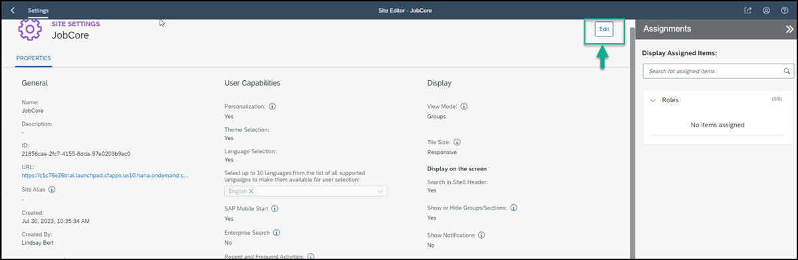
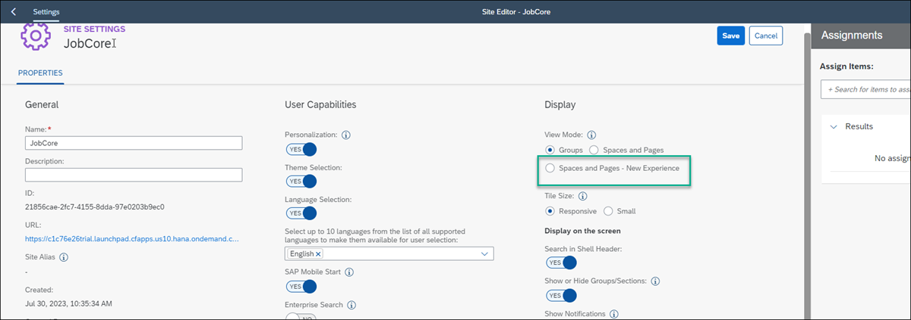

# Create and design a Site Using SAP Build Work Zone, standard edition
<!-- description --> Using SAP Build Work Zone, create a business site to create, view and handle risks. 

 
## Prerequisites
- A CAP service was created and deployed, if you want to try out afterwards you can find a guide here [Create a CAP Service with BAS Productivity Tools](build-apps-cap-service).
- A destination to your CAP service was created, as described in [Expose a CAP Service to SAP Build](build-apps-cap-expose).
- You created an app using SAP Build Apps on the same tenant to which the CAP service is deployed.
- You integrated your process to your App.
- You have subscribed to SAP Build Work Zone, standard edition and was assigned to the Launchpad_Admin role.

## You will learn
- How to create a site using SAP Build Work Zone, standard edition
- How to design a site with the new experience and create a custom Space and Page
- How to integrate your app to your site
- How to integrate pre-deployed UI integration cards to your site 

## Intro
In this tutorial you will create and design your own business site using SAP Build Work Zone, standard edition. You will integrate to your site the app you developed using SAP Build Apps, and UI integration cards that are already deployed to the subaccout.

The site you will design will have a space and a page.

### Open SAP Build Work Zone, standard edition
Open SAP Build Work Zone, standard edition,  with this link:  [SAP Build Work Zone, standard edition](https://ad272-rt8pv9xc.dt.launchpad.cfapps.eu10.hana.ondemand.com/sites#Site-Directory).

SAP Build Work Zone should open.

## Create a site
When you access the SAP Build Work Zone, standard edition, the Site Directory is in focus. From here you’ll create your new site.

In the side panel, you’ll see four tools. The Site Directory where you’re going to create a new site. All sites that you create will be displayed here. The Content Manager where you’ll manage cross-site content such as business apps. The Channel Manager where you manage different channels that expose business content that you can integrate into your sites. The fourth icon opens Settings where you can configure various settings related to your subaccount.

1. Click **Create Site**.

2. Enter JobCore<id> as the site name and click Create. <id> is a unique id you should use to identify your site.

  
You’ve just created a site called JobCore.

## Select the Spaces and Pages - New Experience view mode

When you create a site, you are directed to the Site Settings screen where you can edit the site settings. In this screen, you’ll select the new experience view mode. This is also where you  will assign roles to your site.

By enabling Spaces and Pages – New Experience view mode, you’ll be able to create spaces and pages locally in dedicated editors. You will be able to design your pages by adding sections with UI integration cards and app tiles. If you integrate spaces and pages from remote content providers, they will be displayed side by side with spaces you create.

1. Click Edit in the top right corner of the screen.

   
2. Under **Display**, select **Spaces and Pages - New Experience**.
.

3. Click **Save**

### Navigate back to the Site Directory to view the site tile.
.

Your site is empty for now. In the next tutorials, you’re going to add your app and cards to your site.

## Integrate your app to SAP Build Work Zone

### Fetch updated content using the Channel Manager

1. Click the Channel Manager icon to view any available content providers.

2. Select the HTML5 Apps content provider.

   
3. Click refresh on the HTML5 repository 

The HTML5 Apps content provider should now expose any newly deployed app for integration.

### Add your deployed app to your content
1. Click the icon in the side panel to open the Content Manager.
   

   
The Content Manager has two tabs: My Content where you can manually configure content items and view any other available content items, and the Content Explorer where you can explore exposed content from available content providers, select the content, and add it to your own content.

2.  Click the Content Explorer tab to explore content from the available content providers.

3.  Select the HTML5 Apps provider.

4.  You’ll see that your app that you’ve just deployed in SAP Build Apps, already exists in this provider. Select it and click + Add to My Content.

5.  Click the My Content tab.

Note that your app is in the list of content items.

## Design your site

### Create a page.

1. Open the Content Manager.

   
2. Click **Create** and from the dropdown list, select **Page**.

 
3. Enter a title for the page: **Overview**.

   
### Add cards and your apps to the page
1. In the **Design** tab, click **Edit**.
   

2. Click **Add Section**.

3. Give the section a title **Header** and click Add Widget.
 
   
5. In the Add Widgets screen, click **Cards**.

6. Select the Title card and click **Add**.

7. Click **Add Section**.

8. Give the section a title **Risks** and click **Add Widget**.

9. In the Add Widgets screen, click **Tiles**.

10. Select your app tile and click **Add**.
    
11. Click **Add Widget**. In the Add Widgets screen, click **Cards**.

12. Select risks card and click **Add**.

### Create a space.
1. In the **Content Manager** click Create and then select **Space**.

2. Enter a title for the space: **Home**.

3. In the Pages tab, you’ll see a list of pages and from here you can assign as many pages as you want to the space. We only have 1 page - the Overview page. From the Assignment Status column, click the toggle to assign the **Overview** page to the **Home** space.

4. Click Save.

5. Go back to the Content Manager using the breadcrumbs at the top. You’ll see that the space you created is added to the list of content items.

### Assign your app and space to a role
In this step, you’ll assign the space to a preconfigured role.

Spaces are assigned to a role and users assigned to a specific role are able to access the space and see the relevant pages assigned to it.Content assigned to the Everyone role is visible to all users.

1. From the Content Manager, click the XXX role.

2. Click **Edit**.

3. Under the Spaces tab, you’ll see the **Home** space you just created. Click the toggle to assign the **Home** space to the XXX role. Then click Save.
   
4. Under the Apps tab, you’ll see the **XXX** app you deployed. Click the toggle to assign the this app to the XXX role. Then click Save.

## Assign the roles to your site
1. Navigate to the Channel Manager

2. Click the report to view how many cards and roles were added with this Content Package.

3. Select the Site Editor.

4. Click Edit.

5. Add the XXX and YYY roles to the site.

You now completed designing your site. In the next tutorial you will experience the site as end users will experience it.

