 

# Risk Management App with SAP Build Apps
<!-- description --> In this exercise we will create a SAP Build Apps application that calls a CAP Service and will trigger an approval process with SAP Build Process Automation. 

## Exercise 1.1 Consume a CAP Service in SAP Build Apps 
<!-- description --> Using SAP Build Apps, create an app that calls a CAP service via a destination, updates data, and manages permissions based on SAP BTP role collections.
 
## Prerequisites
- A CAP service was created and deployed, if you want to try out afterwards you can find a guide here [Create a CAP Service with BAS Productivity Tools](build-apps-cap-service).
- A destination to your CAP service was created, as described in [Expose a CAP Service to SAP Build](build-apps-cap-expose).
- SAP Build Apps on the same tenant to which you deployed your CAP service.


## You will learn
- How to import projects
- How to create a data resource from a destination
- How to check BTP permissions to a CAP service
- How to do CRUD operations in SAP Build Apps for a CAP service  


## Intro
Instead of building the entire project from scratch, you will import a project with all the pages created, all the UI components added to the pages, and all the components stylized. Most bindings will also be set.

The app you will help build has 3 pages:

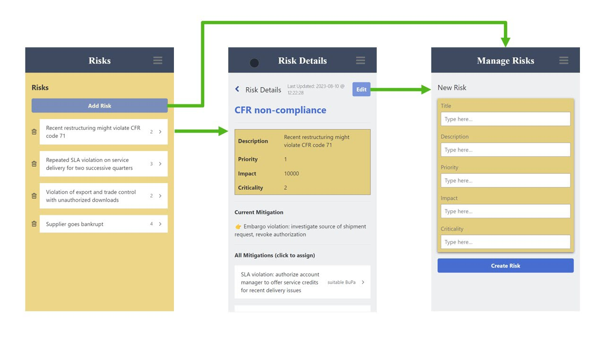

- **Risks:** This page lists all the existing risks (with description and criticality displayed), and includes a button so you can add a new risk.

    Next to each risk is a delete button, which lets you delete a risk from the CAP service.

- **Risk Details:** This page shows all fields for a specific risk, plus the corresponding mitigation selected for the risk (if one exists). The page has 2 actions you can do:

    - There is an **Edit** button to edit the fields. The button takes you to the **Manage Risks** page, which is used for both adding and editing risks.

    - All the existing mitigations are displayed, and you can select one to assign it to the current risk, instead of the currently assigned mitigation.

- **Manage (Add/Update) Risks:** This page lets you add a new risk or update an existing risk (if a risk ID is passed). If you navigate from an existing risk, all the field values for that risk are loaded, and you will be updating that risk.


### Open SAP Build Apps
Open SAP Build Apps with this link: "missing link to lobby"

The SAP Build lobby should open.

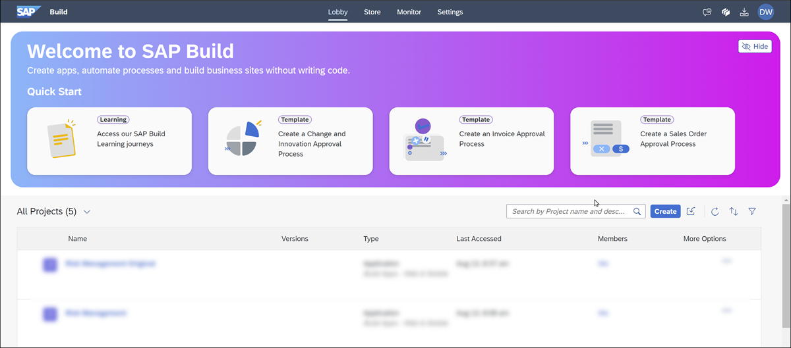


### Import project

>Download the file [Risk Management.zip.gpg](Risk Management.zip.gpg).

> Create a new SAP Build Apps project from the lobby.
> Select Create -> Build an Application -> Web & Mobile Application. Name it Riskmanagement *Your AD272 user id* like "Risk Management AD272-123"

>From within an open SAP Build Apps project, make sure the project is saved. Then go to the upper-right corner, select the 3 dots and then **Replace** -- this import replaces and deletes the current content of the project.

>Select the `gpg` file and click **Replace**.


### Create data resource for CAP app
The first thing you need to do is connect the project to your CAP service via our destination, to retrieve the data. And in order to do this we need to enable SAP BTP authentication.

1. Go to the **Auth tab**.

2. Click **Enable Authentication**, then select **SAP BTP Authentication**.

    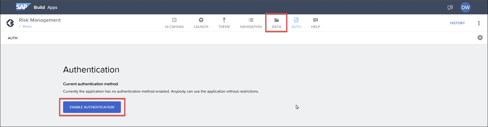
    
    Click **OK**.

3. Go to the **Data** tab.

4. Click **Add Integration**.

    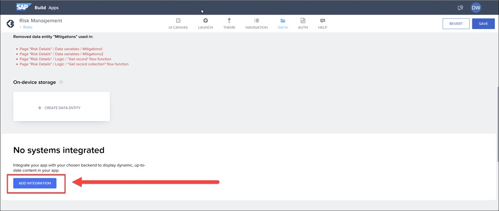

    >Note that there will be many error messages. This is because we already created data variables as well as bindings with those variables, but we deleted the data resources because we wanted you to do that part.

    >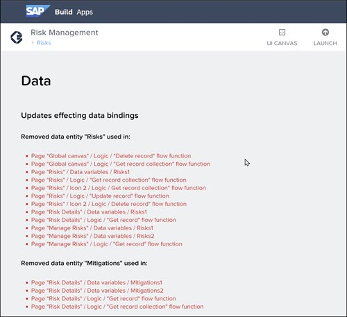

    >You can ignore these error messages. As soon as you create the data resources, they will go away.

5. Click **BTP Destinations**, and then select the destination called **RiskManagement**.

    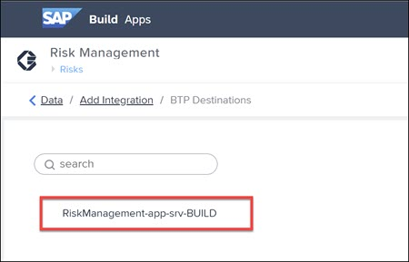

6. Click **Install Integration** (upper right).

    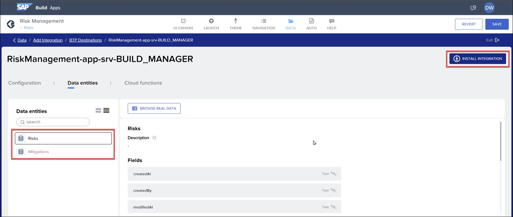

7. For each of the two entities, **Risks** and **Mitigations**, click the entity and then click **Enable Data Entity**.

    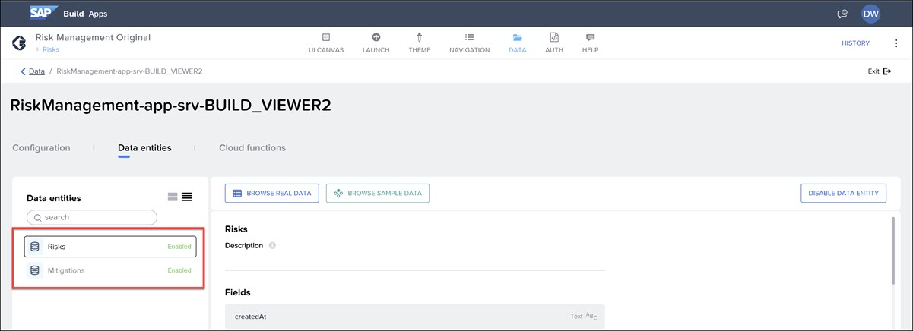

You can now click **Browse Real Data** to see live data from the CAP service.

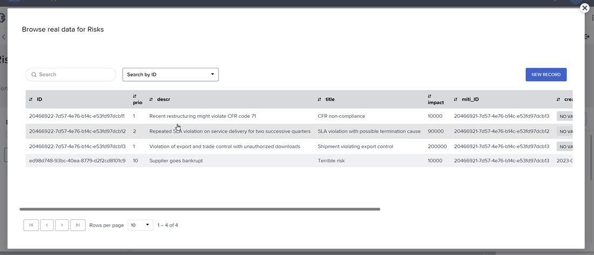

In addition, the errors should now be gone. Data variables were already set up on all 3 pages of the app, and now should be functioning properly.


### Risks – Review logic to check permissions
When the first page loads, we want to do 2 things:

- Load the list of risks
- Check whether user has permission to read / write.

Click the **UI Canvas** tab again to go back to the UI, and then open the logic canvas.

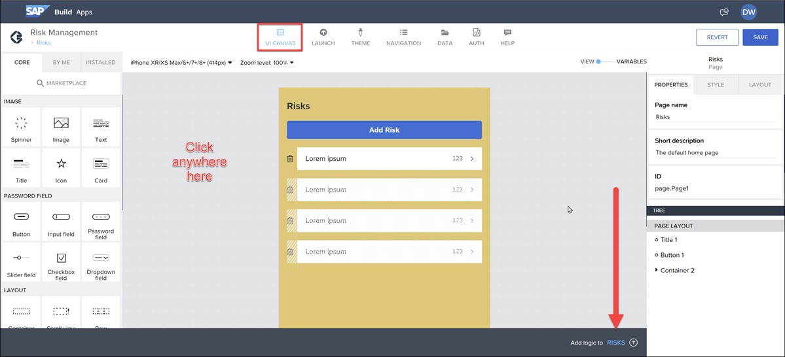

You should see the page's main canvas page (the one you get if you click away from any component/variable, that is, in the open gray area). We've added the following logic:

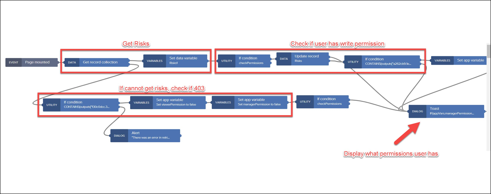

The logic is triggered when the page opens, and the following is performed:

- **Retrieve Risks:** A call is made to the CAP service to get all the risks.
  
- **Check Write Permissions:** If reading the CAP service succeeded, we now check if the user has write permission by making an empty update to the first record (the update does not change the record -- PATCH update with no values). If the update fails, we set a page variable to indicate the user does not have write permission.

- **Check Read Permissions:** If reading the CAP service failed, we check if the reason was because of permissions (403 status error). If yes, we set page variables to indicate the user has neither read nor write permissions.
   
- **Display User Permissions:** After checking permissions, we display a toast message indicating what permission the user has.  

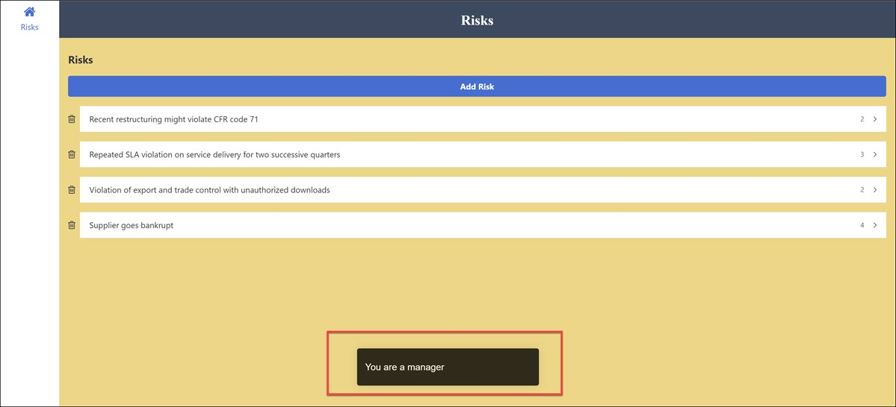


### Risks – Add logic to navigate to add risk
Now we just want to enable the **Add Risk** button to navigate to the **Manage Risks** page.

Select the **Add Risk** button and open the logic panel.

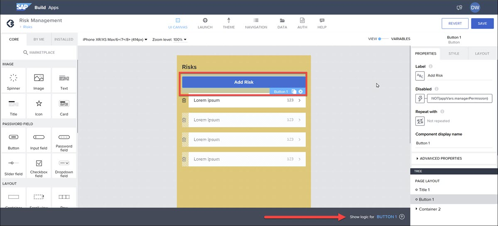

Add an **Open page** flow function, and connect it to the **Page mount** event.

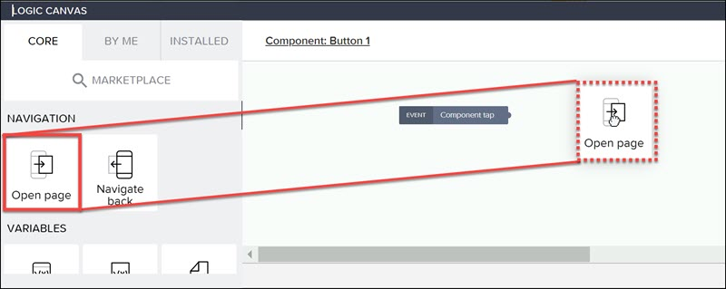

Set the page to open as **Manage Risks**.

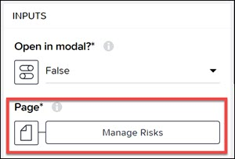

Click **Save** (upper right).


### Test app

Go to the **Launch** tab, then **Open Preview Portal**, then **Web Preview**.

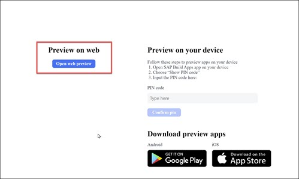

Click **Risk Management** to open the app. You should see the first page with a list of risks.

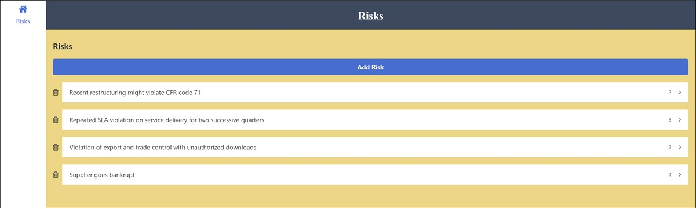

In addition, you see a toast message indicating what permissions you. In this case, since you gave yourself manager permissions, it should say you are a manager.

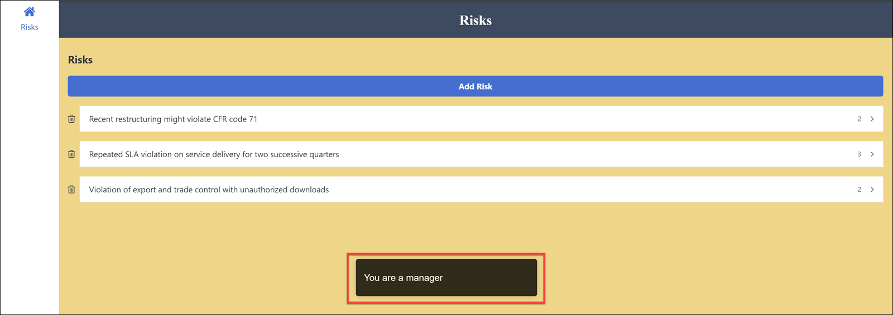

Also, the **Add Risk** button should take you to the **Manage Risks** page (though that page will not let you add a risk yet, and clicking **Create Risk** will not do anything).


### Manage Risks – Add logic to load data
The **Add Risk** page can be used to add a new risk or update an existing risk if navigating from an existing risk.

The page has a page parameter. If sent, the page is for updating; if it's null, the page will be used to add a risk.

1. In the upper left, click the link for the **Risks** page.

    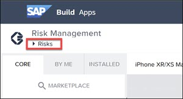

    This will take you to the area for managing the app's pages.

2. Click on the **Manage Risks** page.

    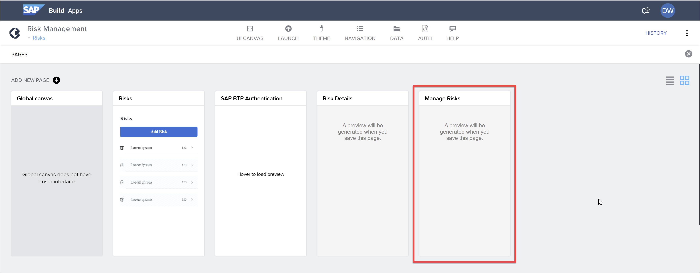

    >If you don't go to the **Manage Risks** page, make sure to save your project (upper right).

3. Open the **Variables**.

    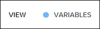

    Click **Data Variables**. You have 2 data variables related to the **Risks** entity:

    - **Risks1:** This variable is specified as a **New data record**, meaning it is empty but has the schema appropriate for this data entity.

        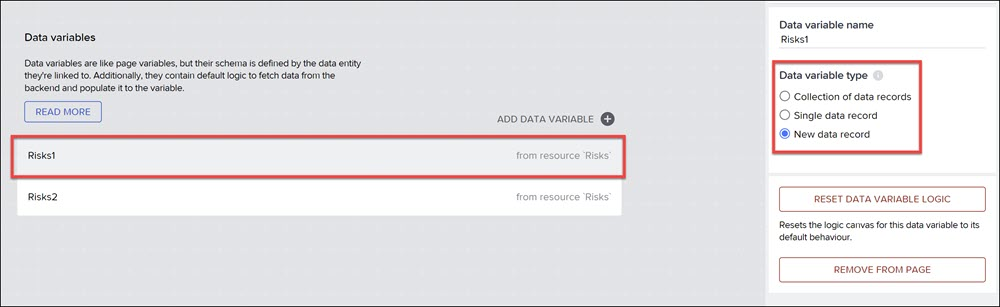

    - **Risks2:** This variable is specified as a **Single data record**, meaning it will retrieve the data of an existing risk if we navigated from an existing risk and we want to update that risk.

    We will be calling the CAP service using **Risks1**. But if we are updating an existing risk, we want to copy the existing values into **Risks1** from **Risks2**.

3. Click **Risk2** and open the logic canvas. You should see the basic logic flow for data variables of type **Single data record** (except we already deleted the **Delay** flow function).

    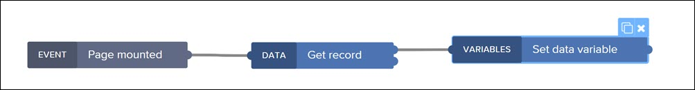

    - Click the **Get record** flow function, and set the **ID** to the page parameter **RiskID**.

        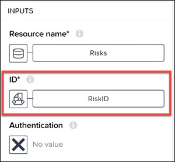

    - Add another **Set data variable** flow function to the end of the flow.

        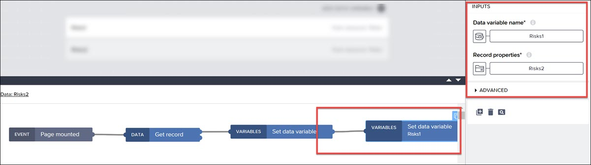

        Set **Data variable name** to the data variable **Risks1**.

        Set **Record properties** to the data variable **Risks2 > Risks2**. 


### Manage Risks – Add logic to add/update risk

1. Back on the **View** tab, click the **Update Risk** button and open its logic canvas.

2. Add logic flow functions and connect them as in the following:

    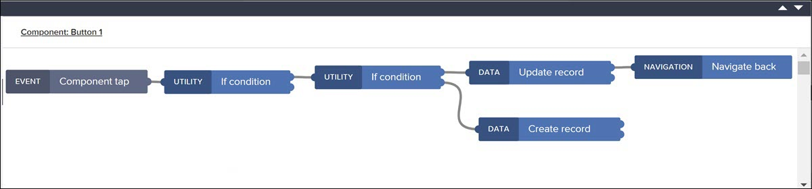

    >Be careful to use the top or bottom output of a flow function, as shown in the image.

3. Configure the flow functions as follows:

    - **IF condition (first):** Set the condition to the following formula (validates the `prio` field):

        ```JavaScript
        NOT(LENGTH(data.Risks1.prio)>5) 
        ```

    - **IF condition (second):** Set the condition to the following formula (checks if we are updating a risk or creating a new one):

        ```JavaScript
        NOT(IS_NULLY(params.RiskID))
        ```

    - **Update record:** Set the following:

        - **Resource name:** Risks

        - **Risk ID:** page parameter RiskID

        - **Record:** Set the following formula (allows us to make sure the integer fields receive a number value):
  
            ```JavaScript
            {impact: NUMBER(data.Risks1.impact), title: data.Risks1.title, descr: data.Risks1.descr, prio: data.Risks1.prio, criticality: NUMBER(data.Risks1.criticality)}
            ```
    
    - **Create record:** Set the following:

        - **Resource name:** Risks

        - **Record:** Set the following formula:

            ```JavaScript
            {impact: NUMBER(data.Risks1.impact), title: data.Risks1.title, descr: data.Risks1.descr, prio: data.Risks1.prio, criticality: NUMBER(data.Risks1.criticality)}
            ```

            >This formula will show as read because we are not supplying an **ID** value. But the CAP service will assign an ID automatically when it is created. You can still save the formula.


4. Add **Alert** flow functions as follows:``

    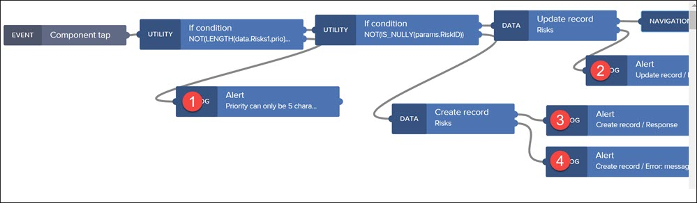

    Set the texts for each alert as follows:

    - **1**

        ```Text
        Priority can only be 5 characters
        ```

    - **2 (if update fails)**

        Set to **Output value of another node > Update record > Error > Message**.

    - **3**

        ```Text
        New risk created
        ```

    - **4 (if create fails)**

        Set to **Output value of another node > Create record > Error > Message**.

5. Click **Save** (upper right).


### Test app
Again, go to the **Launch** tab, then **Open Preview Portal**, then **Web Preview**.

Click **Risk Management** to open the app.

Click **Add a risk** and enter values for the fields (test that priority cannot be more than 5 characters).

Click **Create Risk**.

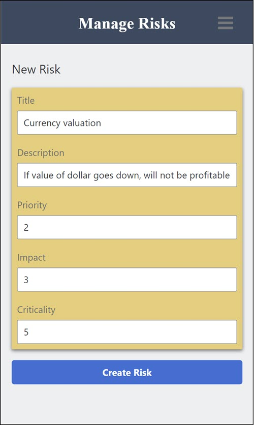

Now use the navigation menu to return to the main page with all the risks, and make sure your new risk is there.

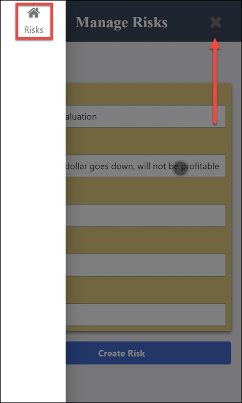

You should see your new risk.

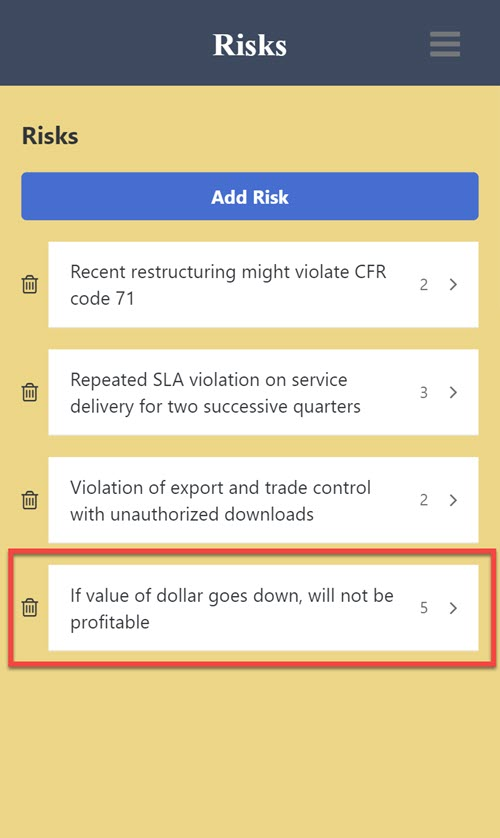

We will check the update functionality later.


### Risk Details – Add logic to edit risk

1. In the upper left, click the link for the **Manage Risks** page.

    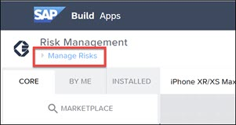

    This will take you to the area for managing the app's pages.

2. Click on the **Risk Details** page.

    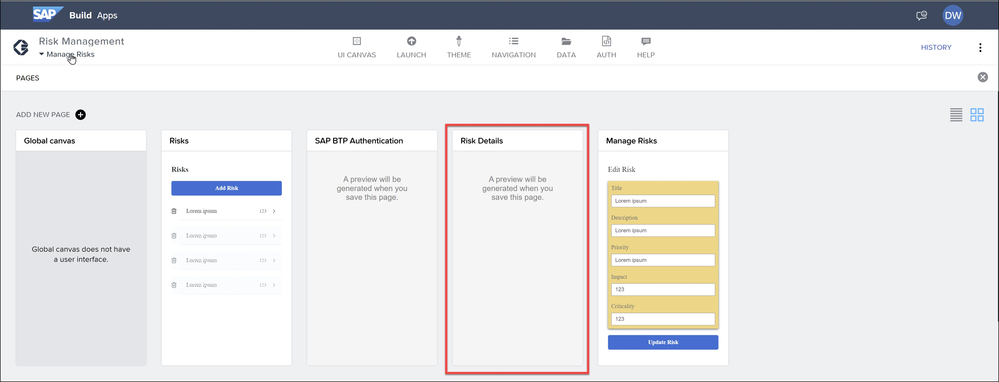

    >If you don't go to the **Risk Details** page, make sure to save your project (upper right) and try again.

3. Click on the **Edit** button, and open the logic canvas.

    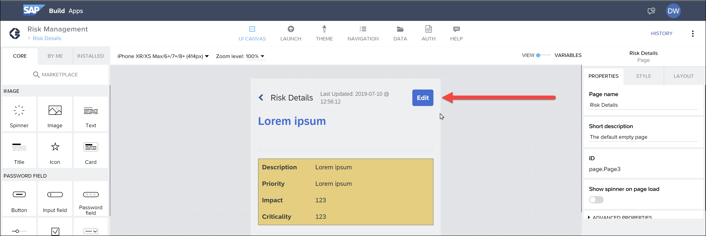

4. Add an **Open page** flow function, and connect it to the **Component tap** event.

    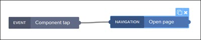

    Configure the **Open page** flow function to open the **Manage Risks** page, and set the **ID** to the **RiskID** page parameter.
    
    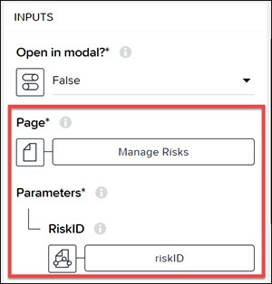


### Risk Details – Review logic to change mitigation
We want to enable the user to see all the existing mitigations, and to click on one to make it the mitigation for the current risk.

Select the list item component (just under the **All Mitigations** text) and open the logic pane.

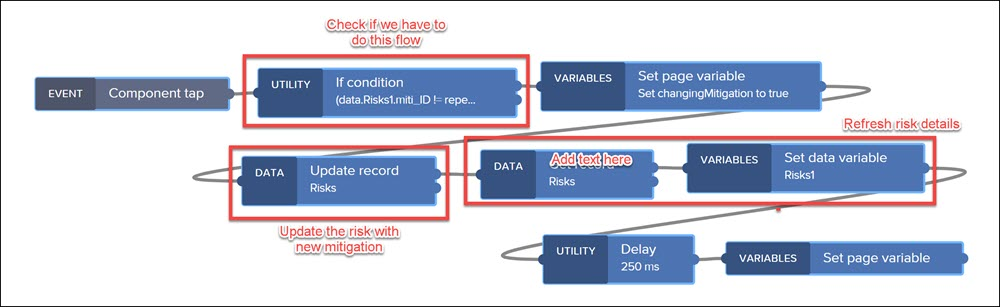

In this logic flow, we do the following:

- **Check Need for Update:** We check 2 things to see if we need to do the update at all:
 
    - Does the user have write permission?
  
    - Did the user select a different mitigation?
  
- **Update Risk:** If both checks are true, we update the risk.
  
- **Refresh Risk Details:** We retrieve the risk details in order o refresh the page.

The other flow functions set the **changingMigration** variable in order to display a spinner while we are updating the record.


### Test app
Again, go to the **Launch** tab, then **Open Preview Portal**, then **Web Preview**.

Click **Risk Management** to open the app.

Click the risk we added earlier. 

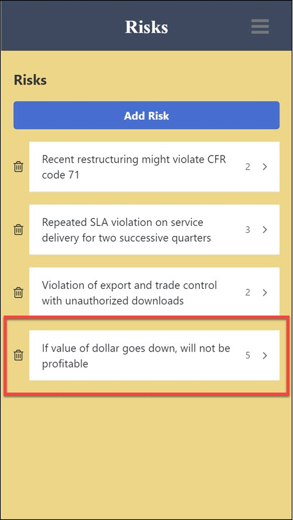

The risk will not have any mitigation. Click one of the mitigations to select it for this risk.

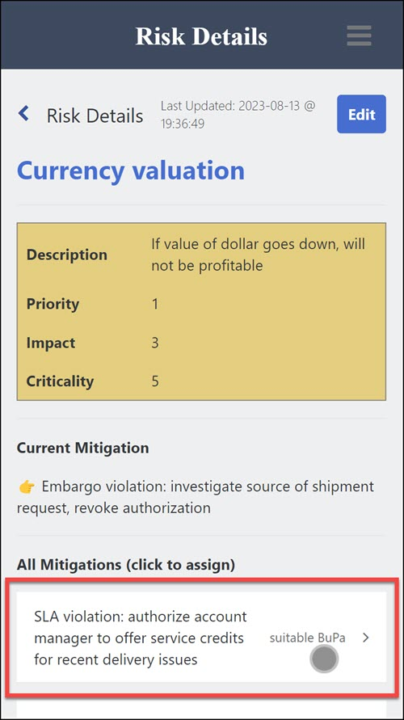

&nbsp;

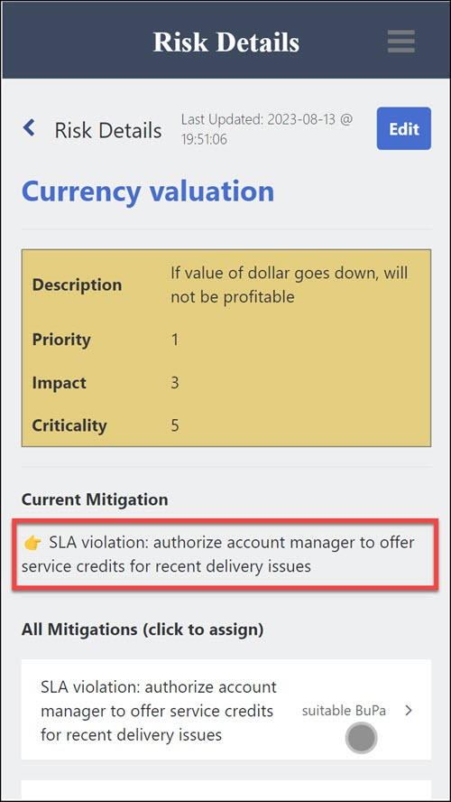

You can click **Edit** and change some of the fields. 

## Exercise 1.2 Create a process trigger  
<!-- description --> In this part we will create a form with a submit button that will trigger a process which will be created in the SAP Process Automation part of this exercise.

Add a new page called **Manage Mitigation**
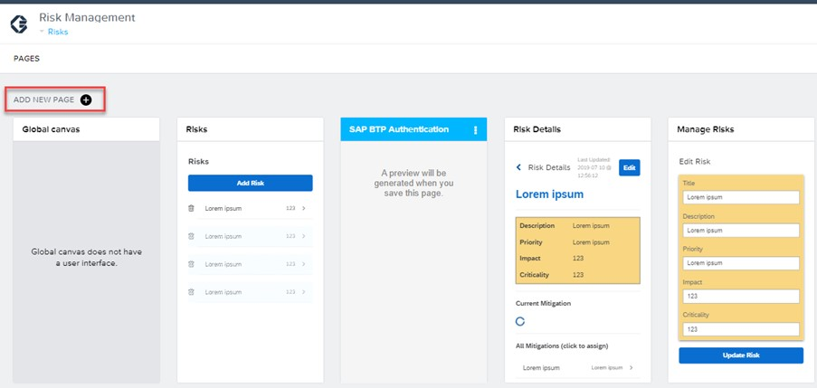

Change Headline to **Create new Mitigation**
Afterwards delete the text field and add three input fields.
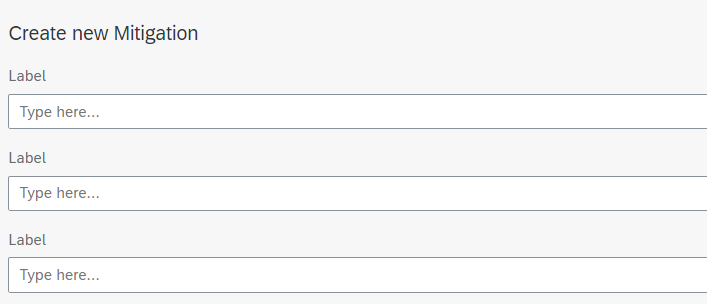

Rename the labels to
•	Owner
•	Timeline
•	Description
Afterwards add a button and rename it “Trigger Approval”
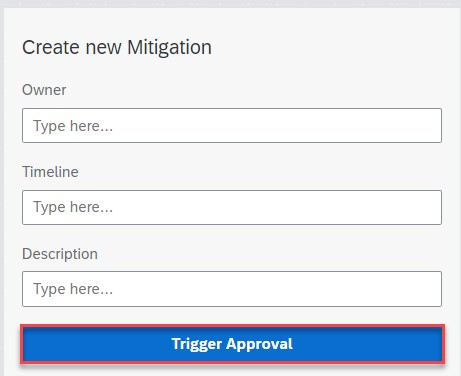

Import Process Automation from marketplace

Go to Variables -> Data Variables -> Add a new Data Variable: Approval Workflow Trigger and change the Data Variable type to New data record
10d-data-variable

Go back to the UI canvas by clicking the **VIEW** toggle

Map the value of the inputs fields to the approval workflow fields of the data variable **Approval Workflow Trigger1**

10e-field-mapping

Select the button and open the logic canvas for the button.
Add a **Create Record**, a **Toast** and an **Alert** and connect it like in the screenshot below:
10f-logic-button

Create Record:
 - Recource Name: Approval Workflow Trigger
 - Record: definitionId=app variabe definitionId
   All other fields from the Data Variable **Approval Workflow Trigger1**
10g-create-record

Toast: -> Toast Message: **Success**
Alert: -> Dialog Title: **Error**

Go to the **Risk Details** page
Add a new button at the end called **Add new mitigation**

Add a **open page** logic component and connect it to the "Component tap" event. Set the Page to **Manage Mitigation**.
