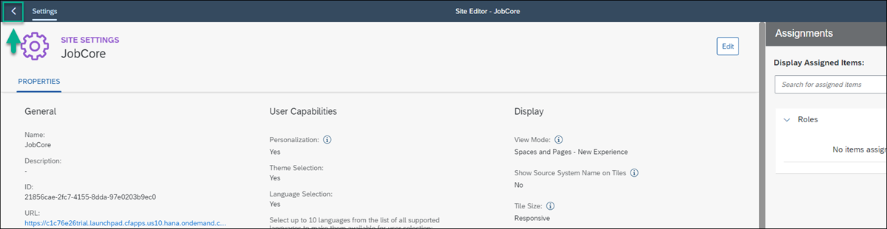

# Create and design a Site Using SAP Build Work Zone, standard edition
<!-- description --> Using SAP Build Work Zone, create a business site to create, view and handle risks. 

 
## Prerequisites
- A CAP service was created and deployed, if you want to try out afterwards you can find a guide here [Create a CAP Service with BAS Productivity Tools](build-apps-cap-service).
- A destination to your CAP service was created, as described in [Expose a CAP Service to SAP Build](build-apps-cap-expose).
- You created an app using SAP Build Apps on the same tenant to which the CAP service is deployed.
- You integrated your process to your App.
- You have subscribed to SAP Build Work Zone, standard edition and was assigned to the Launchpad_Admin role.

## You will learn
- How to create a site using SAP Build Work Zone, standard edition
- How to design a site with the new experience and create a custom Space and Page
- How to integrate your app to your site
- How to integrate pre-deployed UI integration cards to your site 

## Intro
In this tutorial you will create and design your own business site using SAP Build Work Zone, standard edition. You will integrate to your site the app you developed using SAP Build Apps, and UI integration cards that are already deployed to the subaccout.

The site you will design will have a space and a page.

### Open SAP Build Work Zone, standard edition
Open SAP Build Work Zone, standard edition,  with this link:  [SAP Build Work Zone, standard edition](https://ad272-rt8pv9xc.dt.launchpad.cfapps.eu10.hana.ondemand.com/sites#Site-Directory).

SAP Build Work Zone should open.

## Create a site
When you access the SAP Build Work Zone, standard edition, the Site Directory is in focus. From here you’ll create your new site.

In the side panel, you’ll see four tools. The Site Directory where you’re going to create a new site. All sites that you create will be displayed here. The Content Manager where you’ll manage cross-site content such as business apps. The Channel Manager where you manage different channels that expose business content that you can integrate into your sites. The fourth icon opens Settings where you can configure various settings related to your subaccount.

1. Click **Create Site**.

2. Enter JobCore<id> as the site name and click Create. <id> is a unique id you should use to identify your site.

  
You’ve just created a site called JobCore.

## Select the Spaces and Pages - New Experience view mode

When you create a site, you are directed to the Site Settings screen where you can edit the site settings. In this screen, you’ll select the new experience view mode. This is also where you  will assign roles to your site.

By enabling Spaces and Pages – New Experience view mode, you’ll be able to create spaces and pages locally in dedicated editors. You will be able to design your pages by adding sections with UI integration cards and app tiles. If you integrate spaces and pages from remote content providers, they will be displayed side by side with spaces you create.

1. Click Edit in the top right corner of the screen.

   
2. Under **Display**, select **Spaces and Pages - New Experience**.
.

3. Click **Save**

## Navigate back to the Site Directory to view the site tile.
.
Your site is empty for now. In the next tutorials, you’re going to add business apps to your site.

